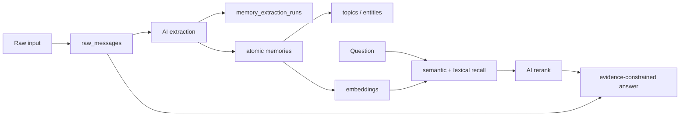

# Personal Brain

A local-first, evidence-first memory system that turns raw messages into traceable atomic memories and answers questions from retrieved evidence.

This repository is a privacy-safe portfolio edition. It contains source code, isolated security tooling, tests, and synthetic demo data. It contains no real user memories, production databases, Router exports, reports, credentials, or private agent context.

## Why this project exists

Most note systems preserve text but leave the user responsible for structuring and finding it. Personal Brain explores a different pipeline:

```text
raw message
→ auditable extraction run
→ atomic memory + metadata
→ embedding-backed recall
→ AI rerank
→ evidence-constrained answer
```

The core design goal is not “more autonomous agents.” It is trustworthy memory formation and retrieval: preserve the original input, keep transformations auditable, and make every answer traceable to evidence.

## What is implemented

- SQLite source of truth for raw messages, extraction runs, memories, topics, entities, embeddings, and interactions.
- AI-assisted atomic-memory extraction with prompt-version audit records.
- Semantic recall with lexical, same-day task, and lifecycle adjustments.
- AI reranking and evidence-constrained answers with memory/raw-message citations.
- Read-only audit reports and Router exports.
- Archive/detail operations and a Windows DPAPI-backed secure vault.
- A generic Feishu adapter.
- Private-path guards, redacted secret scanning, consistent SQLite backup, and isolated restore verification.

## Known limitations

- The current vector search scans stored vectors in Python and scales linearly.
- Retrieval quality needs a larger gold-set evaluation before adopting query-planning Agent RAG.
- Fact, user opinion, hypothesis, effective time, and supersession are not yet modeled as independent dimensions.
- Some read-oriented code paths still initialize schema state; production-grade read/write separation is future work.
- The Feishu adapter and secure vault are Windows-oriented and are not exercised in public CI.

## Architecture



See [docs/architecture.md](docs/architecture.md) for design choices and [docs/security-boundary.md](docs/security-boundary.md) for the public/private data boundary.

## Five-minute offline demo

The demo uses deterministic bag-of-words vectors and data written from scratch for this repository. Fixtures cover a preference, project decisions, a temporary task, a technical viewpoint, a superseded decision, and queries with no matching evidence. It does not access a model, network, local configuration, or production database.

```powershell
python demo/offline_demo.py
python demo/offline_demo.py "What notification policy did the team choose?"
```

## Run the security tests

```powershell
python -m unittest tests.security.test_security_tools -v
```

The tests create isolated temporary Git repositories and a synthetic SQLite database. They never read a production database.

## Optional model-backed setup

1. Copy `config.example.json` to `config.json`.
2. Keep both model integrations disabled until you intentionally configure them.
3. Store API keys in environment variables, never in JSON files.
4. Initialize a new local database:

```powershell
python brain.py init-db
```

The runtime database, reports, Router exports, logs, backups, and local configuration are ignored by Git.

## Repository safety

- All public demo content is synthetic, not anonymized real memory.
- CI rejects private runtime paths.
- Gitleaks scans every new repository history before publication.
- Backup and restore utilities refuse unignored output locations inside a Git worktree.

Read [SECURITY.md](SECURITY.md) and [DEMO_DATA_POLICY.md](DEMO_DATA_POLICY.md) before publishing fixtures or screenshots.

## Project status

This is an alpha portfolio project. The current focus is evaluation, privacy boundaries, recovery, and retrieval quality—not adding a frontend or claiming production readiness.

No open-source license has been selected yet. All rights are reserved unless a license is added later.
