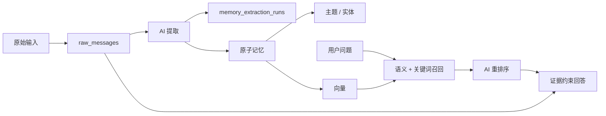

# Personal Brain（个人第二大脑）

一个本地优先、证据优先的记忆系统：将原始消息转化为可追溯的原子记忆，并根据检索到的证据回答问题。

本仓库是经过隐私处理的作品展示版本，只包含源代码、隔离的安全工具、测试和从零编写的合成演示数据，不包含任何真实用户记忆、生产数据库、Router 导出、报告、凭据或私有 Agent 上下文。

## 为什么做这个项目

大多数笔记系统只负责保存文本，信息的整理和查找仍然依赖用户。与此同时，不同的 AI Agent 往往彼此隔离：它们不了解用户过去做过什么、形成过哪些判断，也无法可靠复用其他对话中沉淀的信息。

Personal Brain 不仅是给人使用的记忆工具，也可以作为其他 Agent 的个人上下文层。外部 Agent 可以通过 CLI 或适配器按需检索个人大脑，了解与当前任务相关的历史信息、偏好、决策和待办，并获得能够追溯到原始消息的证据。这样，每个 Agent 不必从零开始了解用户，也不需要直接读取整套私人数据。

Personal Brain 探索的是这样一条路径：

```text
原始消息
→ 可审计的提取过程
→ 原子记忆与元数据
→ 基于向量的召回
→ AI 重排序
→ 受证据约束的回答
→ 为用户或外部 Agent 提供可追溯的个人上下文
```

项目的核心目标不是制造“更自主的 Agent”，而是建立可信的记忆形成与检索机制：保留原始输入、让每次转换都可审计，并让提供给用户或外部 Agent 的每条信息都能追溯到证据。长期目标是让个人大脑成为多个 Agent 可以安全复用、而又由用户掌控的记忆基础设施。

## 已实现功能

- 使用 SQLite 保存原始消息、提取记录、记忆、主题、实体、向量和交互记录，作为唯一事实来源。
- AI 辅助的原子记忆提取，并记录提示词版本以便审计。
- 语义召回，同时结合关键词、同日任务和生命周期等调整信号。
- AI 重排序与证据约束回答，支持引用记忆 ID 和原始消息 ID。
- 只读审查报告与 Router 导出。
- 归档、详情查看，以及基于 Windows DPAPI 的安全凭据库。
- 通用飞书适配器。
- 持久化消息 inbox：先写数据库再确认，数据库级幂等，支持重启恢复，并分别记录业务处理与回复送达状态。
- SQLite WAL/FULL 耐久策略、失败原文重试，以及带 generation/checksum 的 Router 原子发布。
- 私有路径守卫、脱敏秘密扫描、SQLite 一致性备份与隔离恢复验证。

## 可靠性设计

消息入口不会在数据落盘前返回“已接收”。同一外部消息通过数据库唯一键只处理一次；如果进程在处理或回复中途退出，新实例可以从持久化状态继续执行。系统分别记录“业务是否处理成功”和“回复是否真正送达”，避免网络发送失败却被记成成功。

```text
持久化 interaction
→ 返回 accepted
→ 单 worker 领取处理
→ 保存原始消息与提取结果
→ 保存待发送回复
→ 外部发送成功后记录 delivered
```

失败的原始消息可在同一个 raw ID 上重新处理，不会复制原文。读取入口使用只读连接，不会隐式创建或迁移数据库；Router 先生成完整的不可变版本，再原子切换稳定入口。

## 当前局限

- 当前向量检索由 Python 遍历已存储向量，数据量增大后耗时近似线性增长。
- 在引入查询规划型 Agent RAG 前，还需要用更大的标准问题集评估检索质量。
- 事实、用户观点、假设、生效时间和替代关系尚未建模为相互独立的维度。
- 部分只读代码路径仍会初始化数据库结构；生产级读写分离仍是后续工作。
- 飞书适配器和安全凭据库偏向 Windows 环境，暂未纳入公开 CI。

## 系统架构



设计说明见 [docs/architecture.md](docs/architecture.md)，公开与私有数据边界见 [docs/security-boundary.md](docs/security-boundary.md)。

## 五分钟离线演示

演示使用确定性的词袋向量，以及专门为本仓库从零编写的合成数据。测试数据覆盖偏好、项目决策、临时任务、技术观点、已被替代的决策和无匹配证据的问题。运行过程不会访问模型、网络、本地配置或生产数据库。

```powershell
python demo/offline_demo.py
python demo/offline_demo.py "What notification policy did the team choose?"
```

## 运行测试

```powershell
python -m unittest discover -v
```

安全测试会创建隔离的临时 Git 仓库和合成 SQLite 数据库，不会读取生产数据库。

## 可选的模型配置

1. 将 `config.example.json` 复制为 `config.json`。
2. 在明确完成配置前，保持两个模型集成都处于禁用状态。
3. API 密钥只能保存在环境变量或专用秘密管理工具中，不能写入 JSON 文件。
4. 初始化一个新的本地数据库：

```powershell
python brain.py init-db
```

运行时数据库、报告、Router 导出、日志、备份和本地配置均已被 Git 忽略。

## 仓库安全边界

- 所有公开演示内容均为合成数据，不是经过匿名化处理的真实记忆。
- CI 会拒绝私有运行时路径进入仓库。
- 每次发布前均使用 Gitleaks 扫描完整 Git 历史。
- 备份和恢复工具会拒绝将输出写入 Git 工作区内未被忽略的位置。

发布测试数据或截图前，请阅读 [安全政策](SECURITY.md) 和 [演示数据政策](DEMO_DATA_POLICY.md)。

## 项目状态

这是一个 Alpha 阶段的作品集项目。目前重点是评测、隐私边界、数据恢复和检索质量，而不是添加前端或宣称已经达到生产可用状态。

目前尚未选择开源许可证；在后续加入许可证前，保留所有权利。
